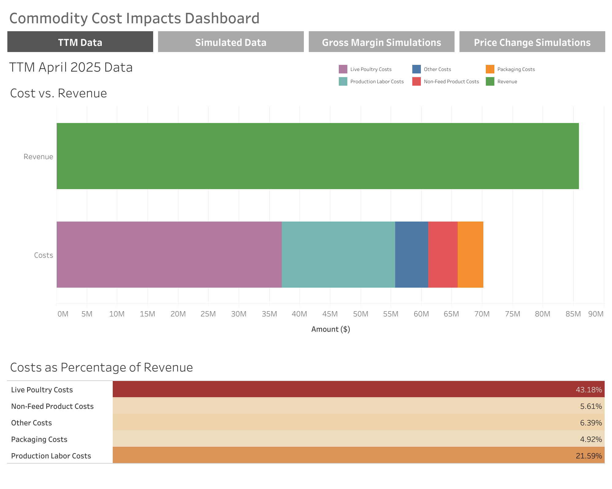
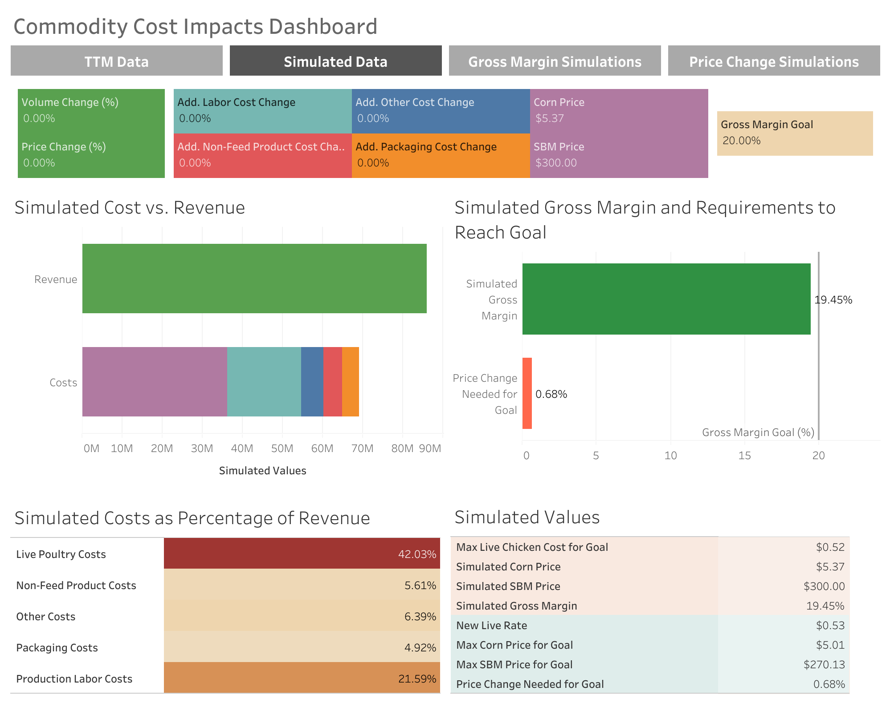
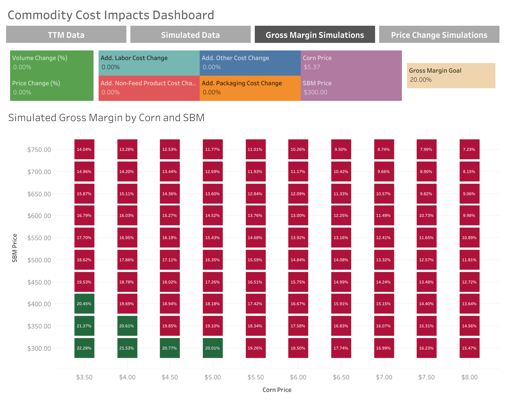
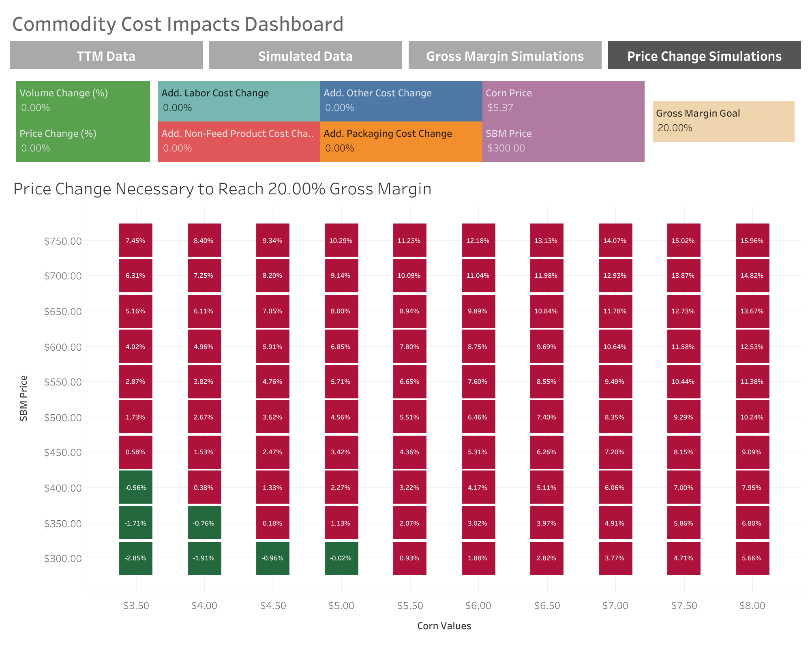

# Commodity Cost Impact Simulation Model

**By Adam Koplik**

## Overview  
During my summer internship at a mid-sized poultry company, I built a financial simulation model to help the company forecast how changes in commodity prices (corn and soybean meal) would affect their gross profit margins. The poultry industry is heavily impacted by fluctuations in feed costs, and the company needed a way to quantify those impacts under different pricing and operational scenarios to support pricing, hedging, and operational decisions.

## Business Problem  
Feed ingredients like corn and soybean meal make up the majority of a poultry processor's costs. These prices are volatile and difficult to predict. Since the company wasn't vertically integrated, they couldn't control these input costs directly.  
To manage risk and profitability, they needed a tool that could:
- Simulate how changes in commodity prices would impact per-pound live chicken costs
- Forecast overall profitability under different operational and market conditions
- Identify pricing or volume changes needed to hit profit margin targets  

## Approach  
I created an interactive simulation tool in R that:
- Allowed users to input different corn and soybean prices
- Modeled the live chicken cost per pound based on those inputs
- Calculated projected gross margins for the company given different revenue, labor, and packaging cost scenarios
- Recommended price changes or volume adjustments needed to meet gross margin targets  

The tool also generated visualizations showing the financial outcomes under different scenarios, making it easier for the executive team to see their cost exposure.

## Tools and Technologies  

- R and RStudio  
- Shiny (for future deployment)  
- `ggplot2`, `dplyr`, `caret`, `flexdashboard`, `plotly`, `tidyverse`, and other R packages  
- Excel for financial data cleaning and prep  
- Converted into Tableau

## Key Results  

- Quantified how a $0.10/bushel change in corn or $10/ton change in soybean meal would affect per-pound costs.
- Identified price ranges and volume scenarios needed to hit a 20% gross margin goal under various commodity market conditions.
- Created dynamic dashboards and scenario tables to visualize results for different hedging and pricing decisions.
- The model accurately matched historical financials with an average gross margin error of less than 0.3%, excluding outlier months like Thanksgiving season.

## Takeaways  

This project taught me how to combine financial modeling, data analysis, and visualization to support operational decision-making in a real business setting. It also reinforced how important it is for mid-sized businesses to have tools that translate complex market dynamics into actionable, day-to-day business strategies.

## Visualizations  

  

## Dashboard Access

[Access the working dashboard here](https://public.tableau.com/app/profile/adam.koplik/viz/CommodityCostImpacts/TTMApril2025Data?publish=yes)

## Full Report  

[📥 Download the full project report PDF here](commodity_cost_impacts.pdf)