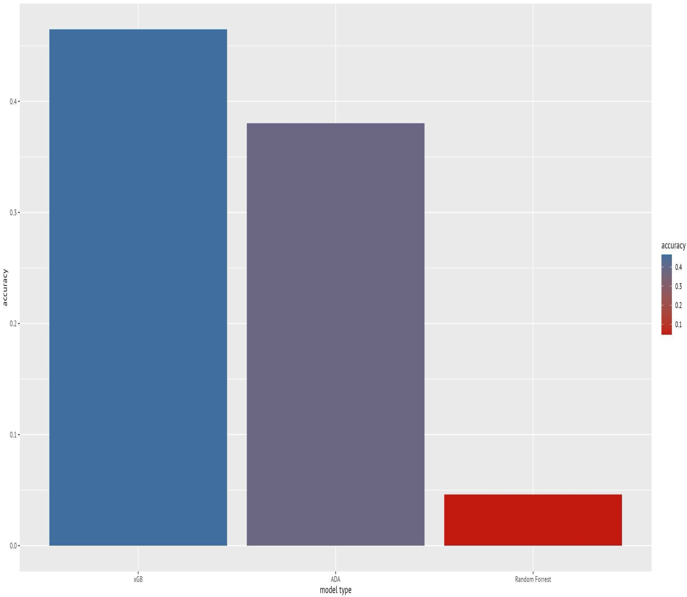
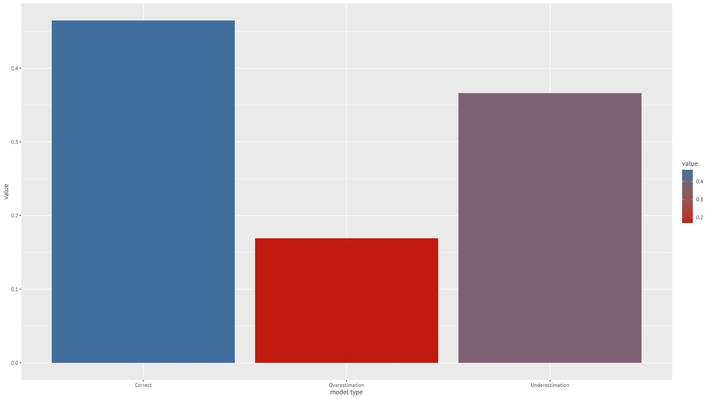
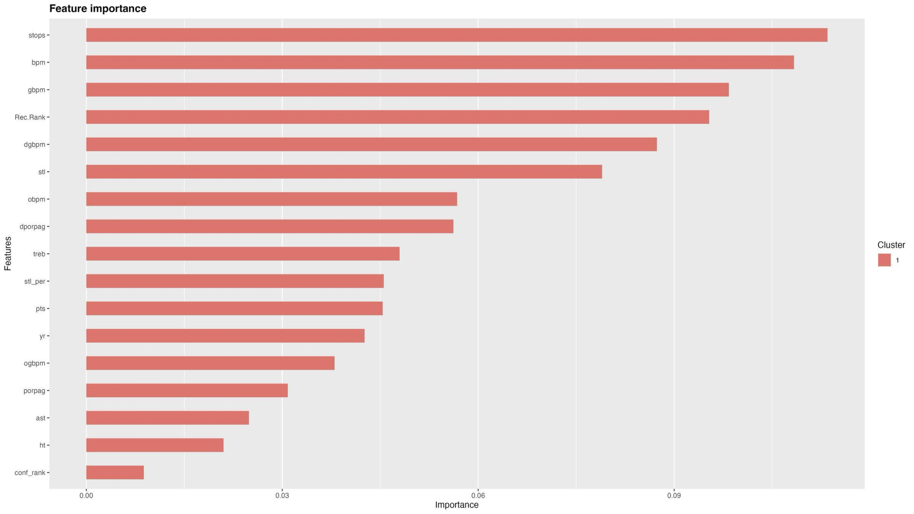
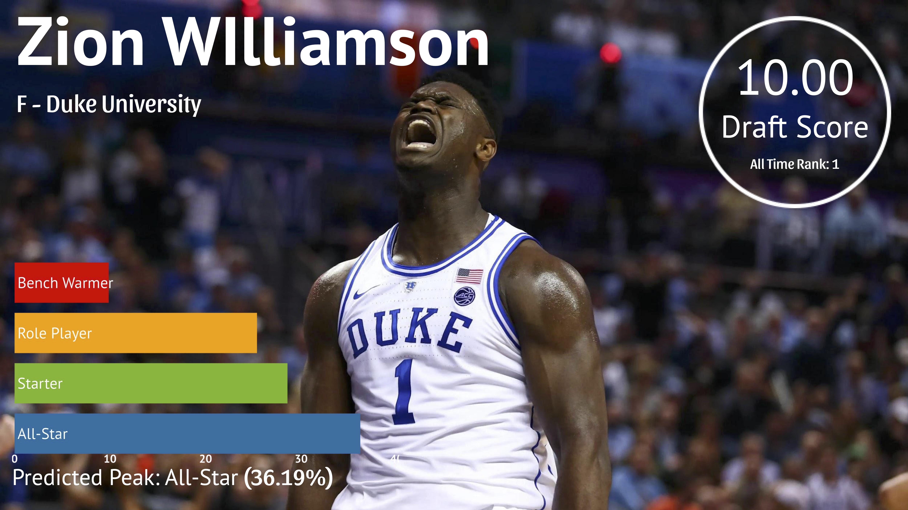
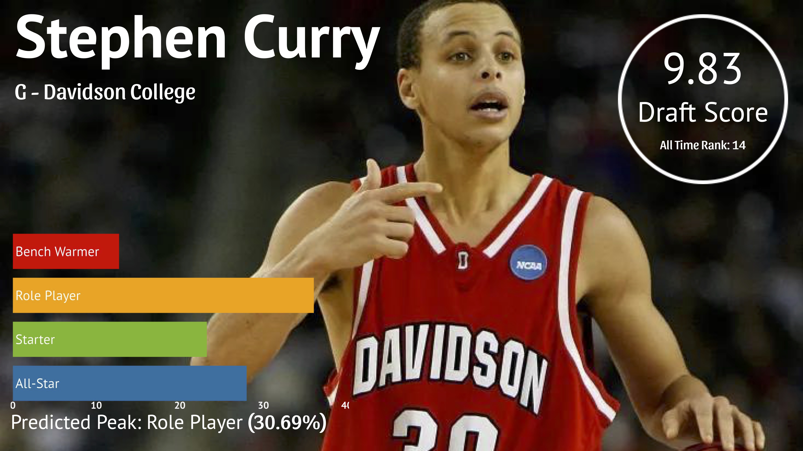
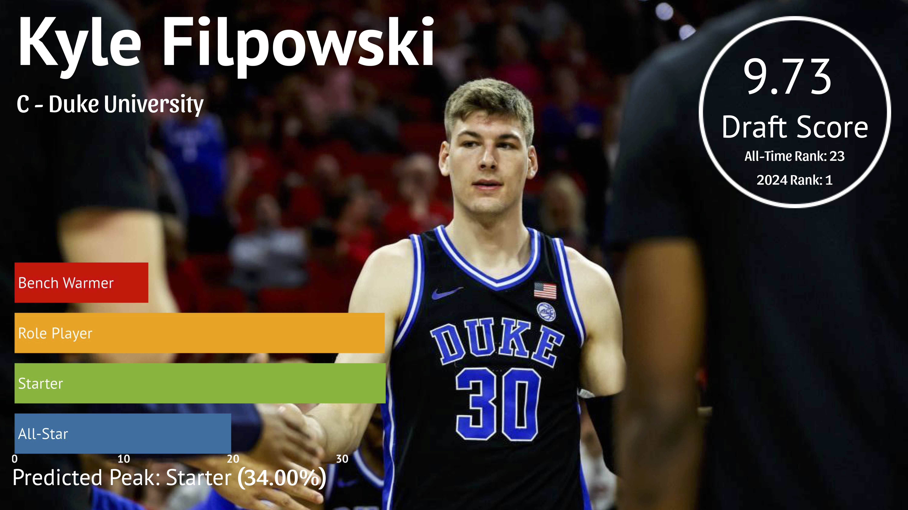
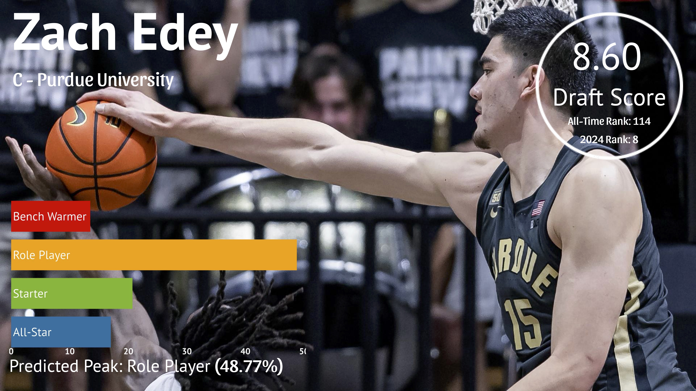
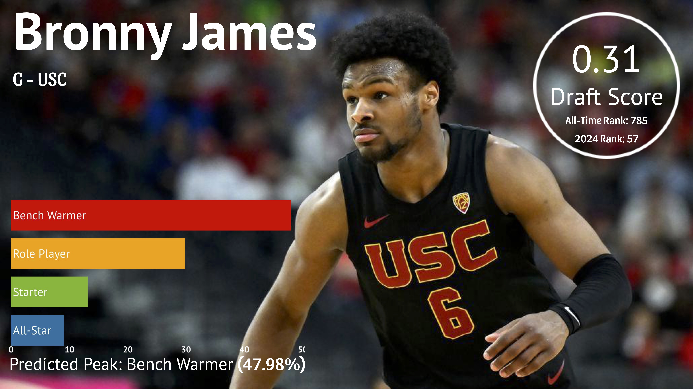

# Boosting Algorithms: Predicting NBA Prospect Peak Performance

**By Adam Koplik & Will Swartz**

## Overview  
This project was built for a Methods in Machine Learning course assignment where we applied several boosting algorithms to predict the future peak performance of NBA draft prospects based on their college basketball stats.

We compared the performance of multiple boosting techniques — AdaBoost, Gradient Boosting, and XGBoost — alongside a baseline Random Forest model to evaluate which approach handled this kind of unpredictable sports prediction problem best.

## Task  

- Build a predictive model using college basketball statistics (from 2009–2023) to forecast a prospect's future “peak” NBA season.
- Peak was measured using **FiveThirtyEight's RAPTOR metric**:
  - Top 10% → All-Star  
  - Top 30% → Starter  
  - Top 70% → Role Player  
  - Bottom 30% → Bench Warmer  
- Training data included only the final college season for each player. The 2024 draft class served as our test set.

## Models Built  

- Single Random Forest  
- AdaBoost Classifier  
- Gradient Boosting  
- XGBoost Classifier  

Each model was hyperparameter tuned, and we evaluated their classification performance and predictive confidence for notable players.

## Key Results  

- **XGBoost** performed the best overall but still struggled with accuracy due to the highly variable nature of NBA outcomes.
- AdaBoost and Gradient Boosting improved on Random Forest in most cases but still reflected the limitations of predicting long-term player outcomes from college stats alone.
- Example predictions:
  - Zion Williamson — Predicted: All-Star (36.2% probability)
  - Zach Edey — Predicted: Role Player (48.8% probability)
  - Bronny James — Predicted: Bench Warmer (48.0% probability)

## Takeaways  

Even with advanced boosting algorithms and hyperparameter tuning, predicting NBA careers from college stats remains a tough problem. Athleticism metrics, combine data, and workout stats would likely improve model accuracy. The project was a good demonstration of boosting algorithm mechanics and the limitations of modeling outcomes in complex, unpredictable domains like professional sports.

## Tools Used  

- Python  
- scikit-learn  
- XGBoost  
- pandas, NumPy  
- Matplotlib, Seaborn  

## Visualizations 

  
  

## Full Presentation  

[📥 Download the full presentation PDF here](boosting_algorthims.pdf)

## Sources  

- FiveThirtyEight RAPTOR player metrics  
- Barttorvik.com college basketball stats  
- Freund & Schapire, *Intro to Boosting*  
- Chen & Guestrin, *XGBoost: A Scalable Tree Boosting System*
