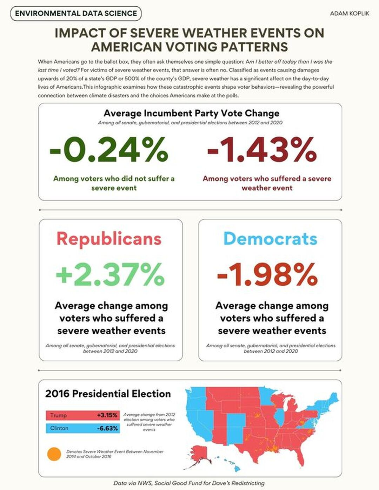
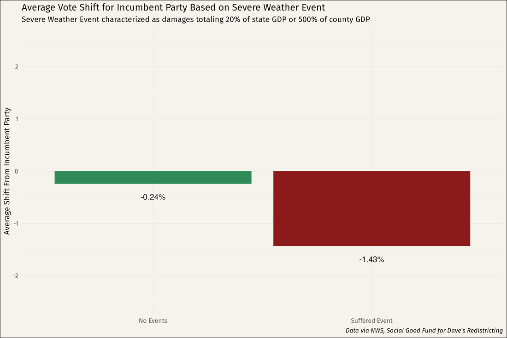
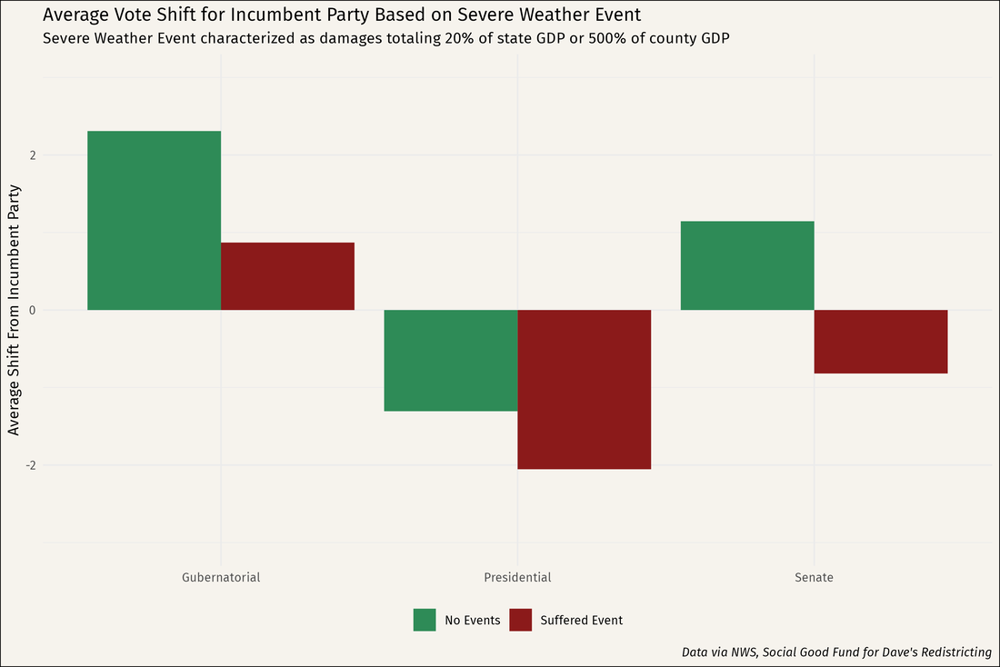
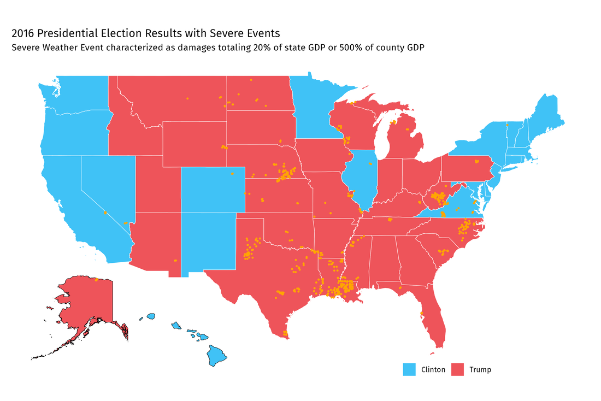
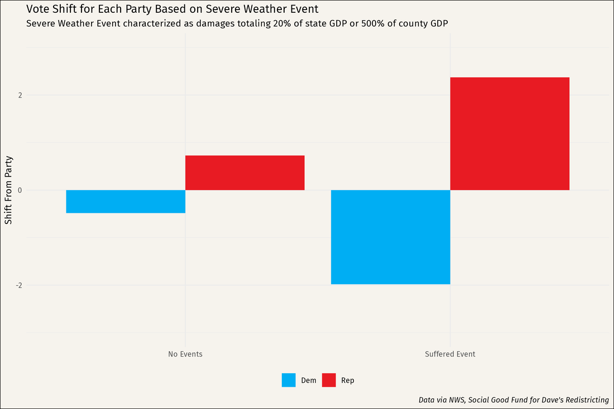
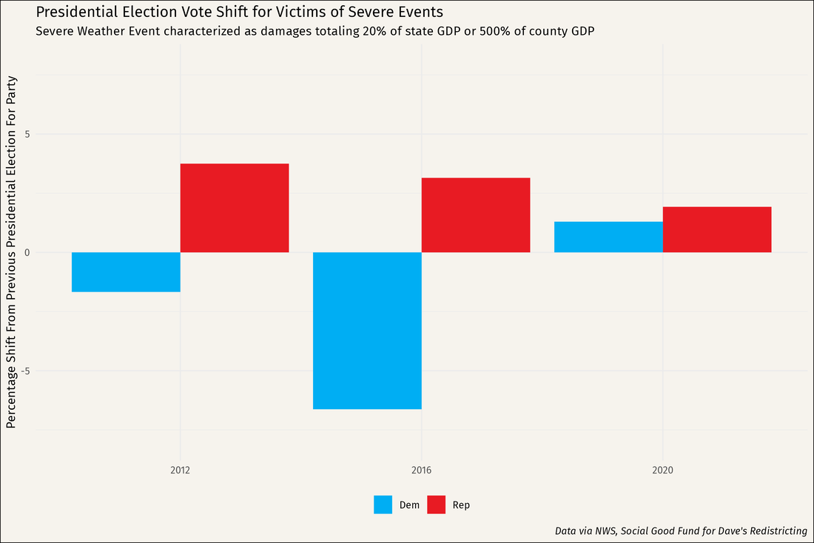

# The Electoral Impacts of Severe Weather Events  
**Adam Koplik**

## Overview  
This project explores how severe weather disasters influence voting patterns in American elections. The idea was to see whether natural disasters push voters to turn against the incumbent party — and whether that trend holds up everywhere, or shifts based on the region and party affiliation.

## Data Sources  
- **NOAA Storm Events Database**  
- **Dave's Redistricting voting data**  
- **US Census Bureau shapefiles**  
- **State and county GDP figures from the US Bureau of Economic Analysis**

## Methods  
After cleaning and merging voting, spatial, and economic data using district-level GEOIDs, I mapped severe storm events to their respective voting districts. Then, I calculated how many severe weather events each district experienced leading up to an election.

A threshold was set to define a “severe” weather event as one causing damage worth at least **20% of a state's GDP** or **50% of a county's GDP**. I used RStudio to run regression analyses measuring the relationship between disaster exposure and changes in incumbent vote share.

## Key Results  
- Districts hit by severe weather events typically saw a **notable drop in support for the incumbent party**.
- The trend was highly statistically significant (p-values < 0.0000002).
- However, the pattern varied in 2020. Despite the general anti-incumbency effect, **Donald Trump actually gained votes in many disaster-affected areas**, while Joe Biden also picked up some support, but not as much.
- This suggests the politics of disaster response are more complicated than a simple “blame the party in power” dynamic.

## Visualizations  
**Infographic and Data Visualizations:**  

  

## Conclusions  
While this trend is consistent across many instances, the impact appears to be more nuanced in the case of the 2020 Presidential election. Despite the general anti-incumbency effect, Donald Trump actually gained votes among disaster victims, with Joe Biden also experiencing some increase in support, though to a lesser extent.

Two main factors seem to explain this divergence:
- **Disasters often strike rural, Republican-leaning areas**, where residents may naturally favor GOP candidates.
- **Democrats are frequently conflated with “the government” as an institution**, while Republicans are perceived as more independent from federal authority, meaning voters may punish “the government” (and thus Democrats) regardless of who's in power.

In sum, while severe weather events do have a clear impact on voter behavior, the changing of votes may not always follow predictable patterns, especially when party dynamics and regional predispositions come into play.

## Tools Used  
- R, RStudio
- ArcGIS Pro  
- NOAA & Census APIs  
- ggplot2 for data visualization  

---

*Built for my Environmental Data Science course at Hamilton College (Fall 2024).*
