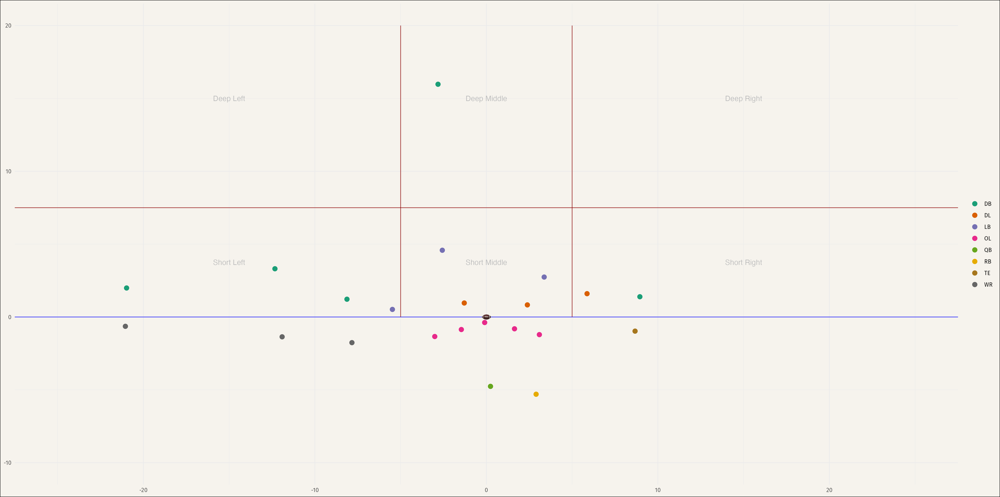
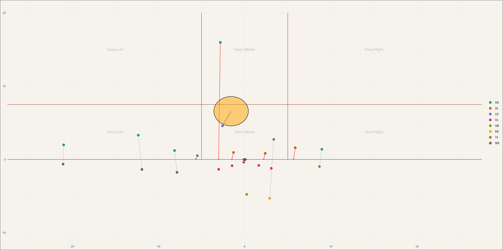
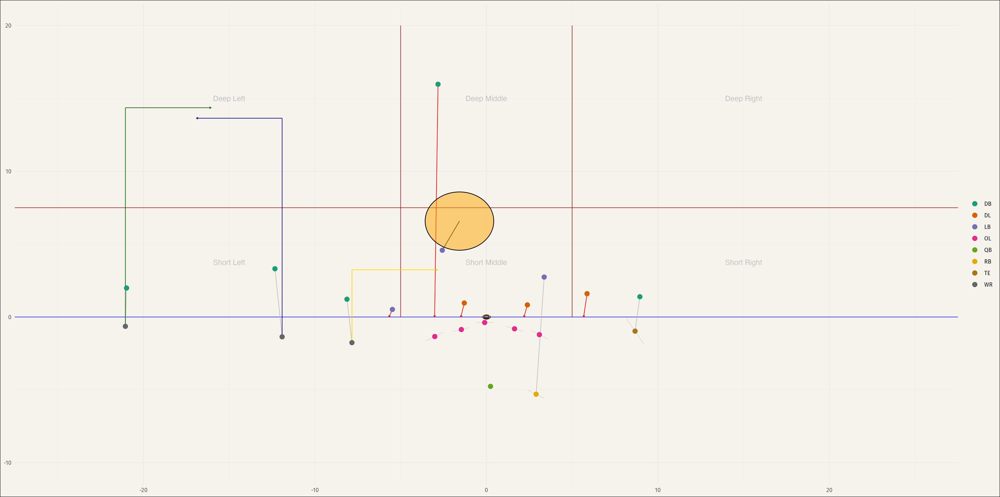

# Be the QB: Optimizing Offensive Play Calls Based on Predicted Defensive Assignments

**By Adam Koplik & Ian Fratarcangeli — NFL Big Data Bowl (Undergraduate Track)**

## Overview  
This project aims to simulate the decision-making process of an NFL quarterback by predicting defensive assignments based on pre-snap positioning data, then using those predictions to identify the optimal offensive play call.  

What started as an effort to predict overall defensive coverages (like Cover-2, Cover-3) evolved into predicting individual defender assignments on each play.

## Data Sources  
- **NFL Big Data Bowl 2023 Player Tracking Data**
- Pro Football Focus (PFF) coverage assignment labels
- Play-by-play and game metadata  

## Process Summary  

### Defensive Assignment Prediction  
- Cleaned and processed tracking data, filtered to pass plays only.
- Simplified PFF coverage labels into 4 assignment types:
  - Blitzers
  - Man coverage
  - Short zone
  - Deep zone  
- Standardized field direction and computed player distances from the ball.
- Built a **Random Forest model in R** to predict defender assignments based on player position, distance from the ball, formation, game situation, and other variables.
- Achieved high accuracy (83.5%) in predicting individual defensive roles.

### Offensive Play Optimization  
- Created an **xGBoost Expected Points Added (xEPA) model** to estimate play outcomes based on:
  - Defensive assignments
  - Pre-snap player locations
  - Offensive personnel and assignments  
- Defined a feasible region of possible offensive assignments per formation.
- Ran simulations to find the offensive player assignments that would maximize expected points based on predicted defensive assignments.

## Key Findings  
- The model favored passing plays ~97% of the time due to higher EPA values — a limitation reflecting real-world play-calling constraints.
- Deep-in routes for WR1 and varied route combinations for WR2/WR3 often produced the best expected outcomes.
- Defensive player positioning and assignments at the snap had a huge influence on play outcome expectations.

## Tools Used  
- R, RStudio  
- RandomForest & xgboost libraries  
- Caret for model tuning  
- NFL Big Data Bowl player tracking data  

## Limitations  
- Model excluded QB runs, option plays, and non-standard formations.
- Did not account for game context (clock management, momentum, fatigue).
- “Optimal” play calls were based solely on maximizing EPA — not always realistic or aligned with coaching strategy.

## Visualizations  

  

## Full Report  
📥 [Download full project report PDF here](BeTheQB.pdf)

## Acknowledgements  
Huge thanks to Prof. Chinthaka Kuruwita for his guidance on this project and for helping us grow as stats students.

---

*Submitted for the NFL Big Data Bowl Undergraduate Track, Fall 2024.*
