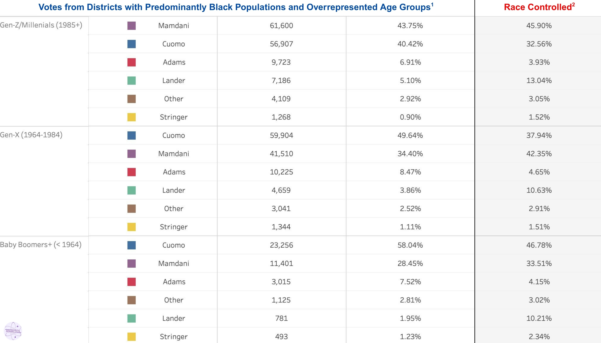
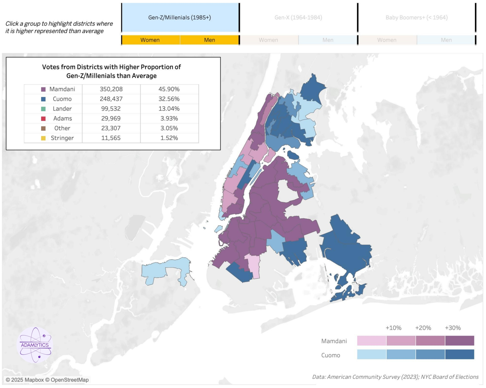
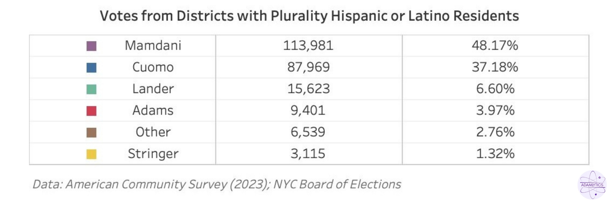
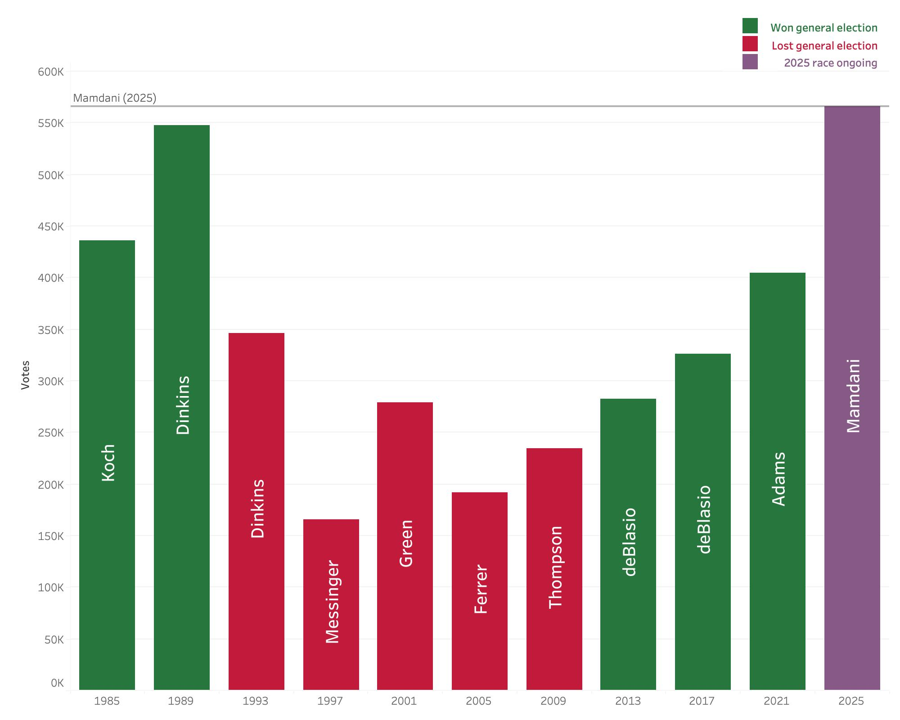
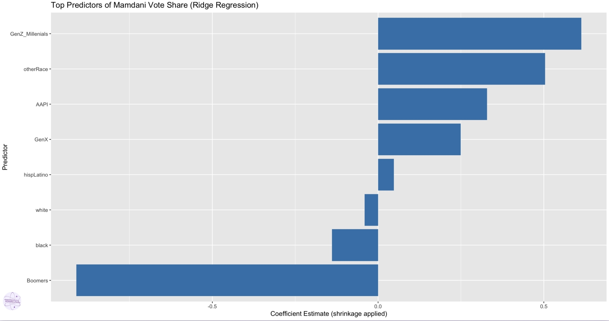

# NYC Local Election Analysis: How Zohran Won

**By Adam Koplik**
## Overview

I conducted an analysis of the 2025 Democratic primary for New York City mayor, where leftist Zohran Mamdani earned an overwhelming victory over multiple foes, the main of which being former Governor Andrew Cuomo.

## Project Scope

- Pulled and cleaned precinct-level election results  
- Mapped each precinct’s results to visualize where Zohran overperformed  
- Analyzed trends in districts by age, race, and voter demographics  
- Used regression analysis to understand voting patterns across different groups  
- Looked at turnout increases, candidate strategies, and demographic shifts

## Key Findings

- Mamdani’s campaign focused on registering new voters, contributing to over 37,000 new voters in the 90 days before the election compared with 3,000 in the same period in 2021.
- Mamdani had strong support in predominantly Hispanic, Latino, and AAPI-heavy districts.
- His grassroots, Instagram-based campaign resonated with young voters, especially in Gen-Z and Millennial-heavy areas.
- Struggled with older voters and in predominantly Black districts, where Cuomo held a noticeable advantage.
- Among Gen-X, there was a notable gender split in Mamdani’s support — stronger among men than women.

## Data and Tools Used

- American Community Survey (2023)
- NYC Board of Elections results
- New York Times voter registration reporting
- R (tidyverse, glmnet, ggplot2)
- Tableau for data visualizations

## Visualizations

 
 

## Full Article  

[Read the full analysis on Medium](https://medium.com/@adam.jb.koplik/how-zohran-won-9dfd2d96d277)