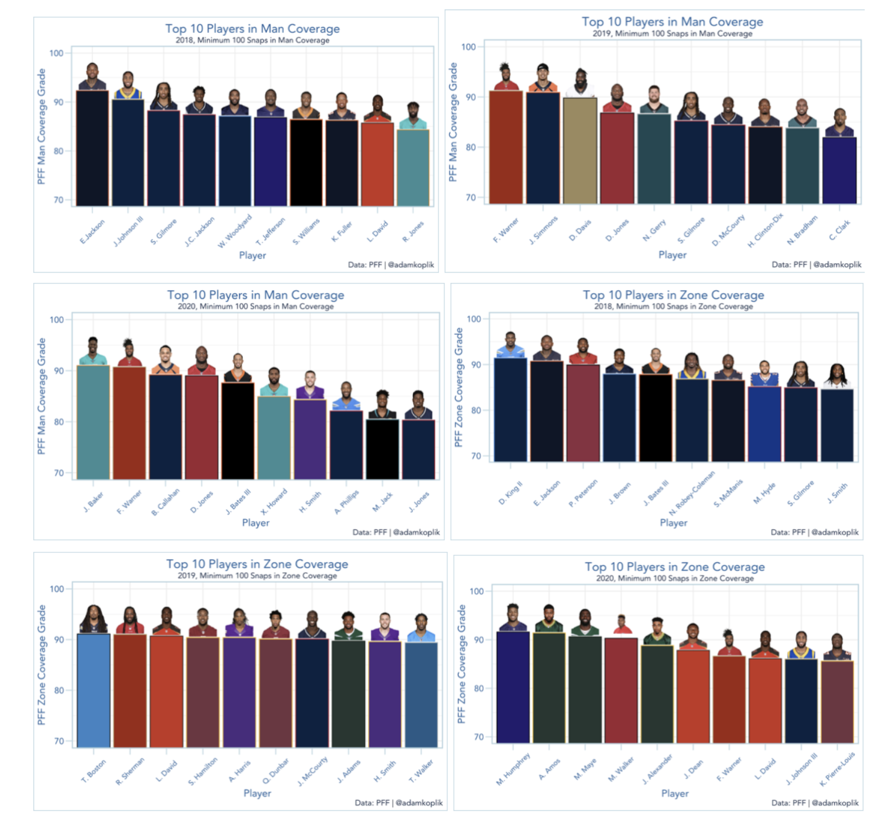

# Beating Zone Coverage: NFL Coverage Efficiency Analysis

**By Adam Koplik and Ajay Patel**

## Overview  
This was one of my first deep dives into football analytics — a research project focused on identifying which passing concepts work best against different zone coverages in the NFL. The goal was to analyze trends in offensive success rates against Cover-2, Cover-3, and Cover-4 defenses, and to recommend strategic adjustments for teams facing those schemes.

## Data Sources  

- NFL tracking data  
- Play-by-play data with coverage tags  
- Publicly available player route and result data  

## Approach  

- Collected play-by-play data and filtered for passing plays against Cover-2, Cover-3, and Cover-4 defenses.
- Calculated success rates and EPA (expected points added) for different passing concepts like verticals, flood, slant/flat, and mesh.
- Compared average EPA per concept against league averages by coverage type.
- Visualized which concepts consistently outperformed expectations against specific coverages.

## Key Findings  

- **Flood and mesh concepts were especially effective against Cover-3 defenses**.
- **Verticals struggled against Cover-4 but performed well against Cover-2**.
- Teams were often over-relying on certain concepts in unfavorable matchups, missing opportunities to exploit defensive tendencies.

## Tools Used  

- R, RStudio  
- `ggplot2` for data visualization  
- Excel for data prep and manual coverage tagging  

## Takeaways  

This was my introduction to working with football data and play-by-play analysis, and it gave me an early sense of how much nuance there is in matchup-based play calling. It also laid the foundation for later, more advanced NFL data projects I've worked on — including the NFL Big Data Bowl.

## Visualizations  

## Project Link  

[📥 Download the full project report PDF here](ZoneCov.pdf)