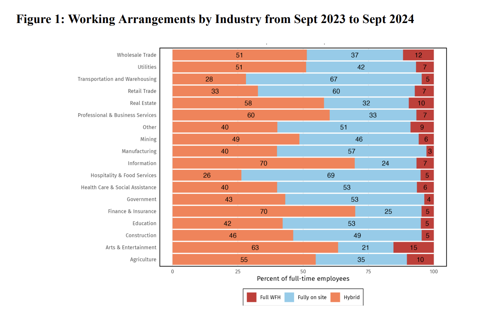
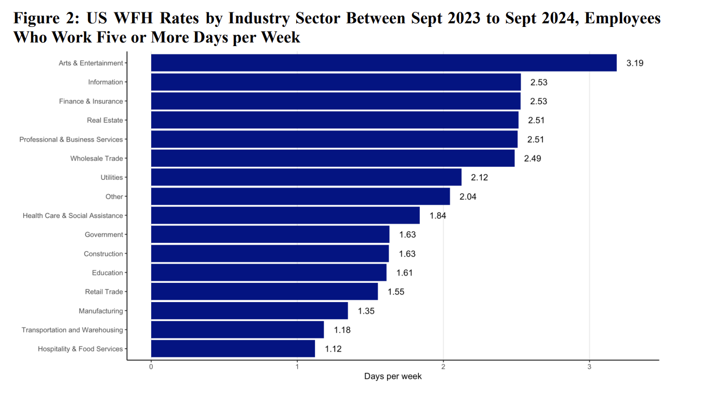
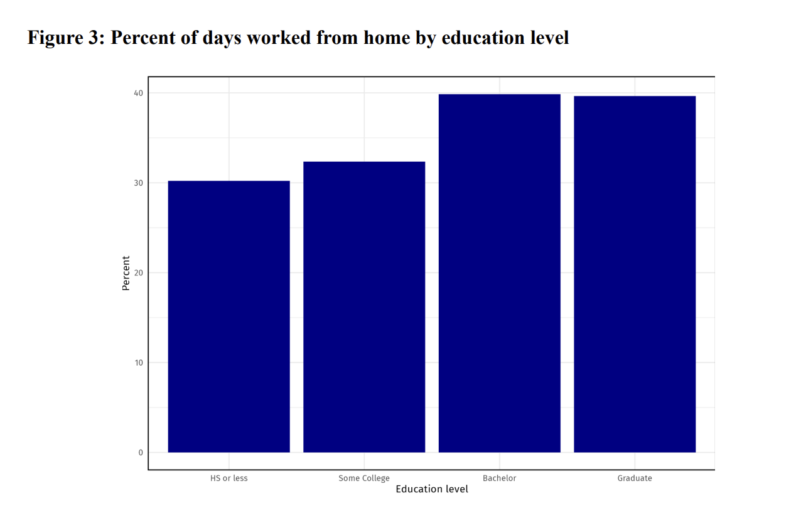

# Pajamas & Paychecks: How Work From Home Policies Are Reshaping Unemployment Across the U.S.

**By Adam Koplik, Kevin Cavicchia, and Simon Le**

## Overview  
This project looks at how remote work policies — both fully remote and hybrid — are affecting unemployment rates across industries in the U.S. As remote work continues to reshape the labor market post-pandemic, we wanted to see whether encouraging work-from-home arrangements helps or hurts job retention within different sectors.

## Data Sources  
- **Survey of Working Arrangements and Attitudes (SWAA)** — monthly survey on work arrangements since 2020  
- **Bureau of Labor Statistics (BLS)** — industry-level unemployment data  
- **American Time Use Survey (ATUS)** — telework potential scores by industry  
- State policy data from Oklahoma, Maryland, Vermont, and Wisconsin on remote work incentives  

## Methods  
We took a **two-stage regression approach**:
1. **Stage 1:** Measured how state-level remote work policies affected the share of remote workers within industries.
2. **Stage 2:** Measured how changes in remote work share impacted industry unemployment rates.

We differentiated between:
- **Fully remote work**
- **Hybrid (part-time remote) work**

Used control variables for age, gender, race, education, and state/time fixed effects to isolate the effects.

## Key Results  
- **Fully remote work policies slightly increased unemployment rates** within affected industries.  
- **Hybrid work policies had the opposite effect — reducing unemployment rates** by about 1.6 percentage points for every 1% increase in remote work share.  
- Hybrid work seems to offer a sweet spot: providing flexibility without sacrificing job stability.

**Fun fact:** Hybrid work has become the new normal, with over 47% of U.S. employees working in some sort of hybrid arrangement by late 2023.

## Visualizations

  

## Takeaways  
Remote work's impact on unemployment isn't straightforward. Fully remote policies might lead to layoffs or restructuring in industries where physical presence matters. Hybrid work, though, seems to strike a good balance between productivity and flexibility, making it a safer bet for policymakers trying to protect jobs.

## Tools Used  
- R, RStudio  
- Stata  
- SWAA, BLS, ATUS datasets  
- LaTeX (for academic writeup)

## Limitations  
- Only four states had remote work policies in place during our study window, limiting generalizability.  
- SWAA data is pooled cross-sectional — can't track individual workers over time.  
- Variations in industry labeling across datasets required careful manual standardization.

## Full Paper  
📥 [Download the full PDF paper here](Pajamas_Paychecks.pdf)

---

*Built for my Labor Economics seminar at Hamilton College (Spring 2024).*