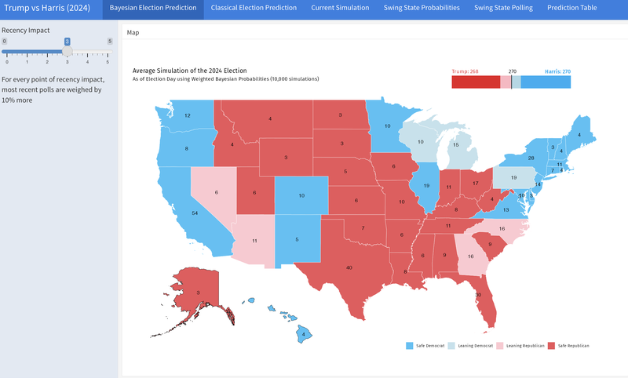
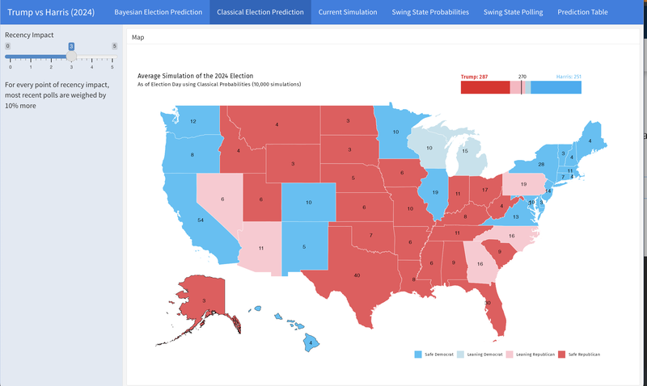
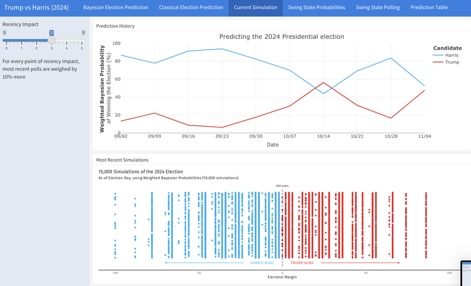
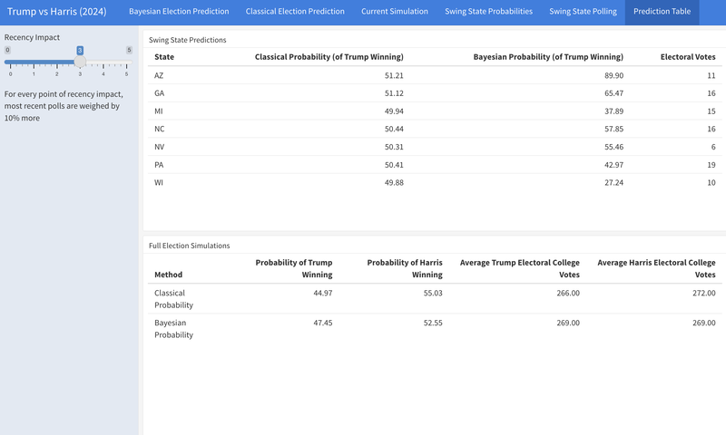

# 2024 Presidential Election Prediction Model

**By Adam Koplik**

## Overview  
This project forecasts the outcome of the 2024 U.S. presidential election using a weighted Bayesian probability model applied to national and swing state polling data. The goal was to create an interactive, real-time dashboard that updates predictions for each state and the overall election outlook.

## Data Sources  
- National and state-level polling data from major aggregators  
- 2020 election results for model calibration  
- State electoral vote allocations  

## Methodology  
- Built a **weighted Bayesian model** that updates candidate win probabilities as new polls come in.
- Incorporated weightings based on:
  - Pollster historical accuracy  
  - Sample size  
  - Recency of the poll  
- Simulated 10,000 election scenarios to generate state-by-state probabilities and national outcome distributions.
- Developed an **RMarkdown dashboard** hosted via **ShinyApps.io** to visualize live election forecasts and swing state probabilities.

## Key Features  
- **Swing State Win Probability Map**
- **State-by-state vote share predictions**
- **Projected Electoral College outcomes**
- **Interactive dashboard viewable online**

## Visualizations
  

## Tools Used  
- R, RStudio  
- `brms`, `tidyverse`, `shiny`, `ggplot2`  
- RMarkdown for dashboard construction  
- ShinyApps.io for deployment  

## Live Dashboard  
📊 [View the interactive dashboard here](https://adamjbkoplik.shinyapps.io/2024ElectionModel/#section-swing-state-probabilities)

## Limitations  
- Model assumes polls are unbiased on average, though real-world polling error is inevitable.
- No adjustments made for early voting patterns or state-level ballot access complications.

---

*Built for my Statistics Senior Seminar, Fall 2024.*